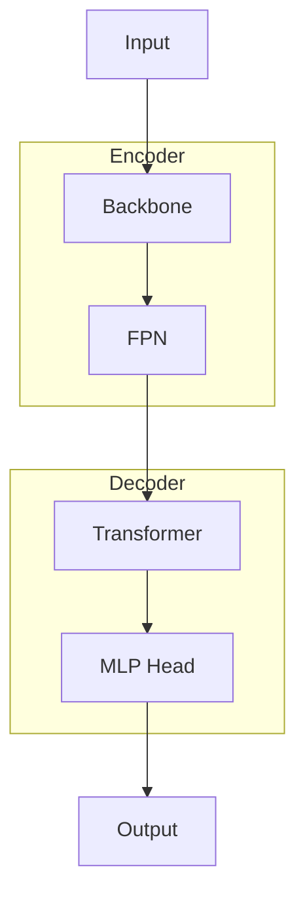
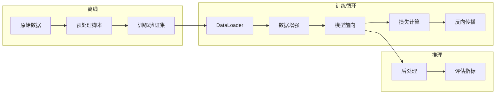

# DL Wiki Enhancement Spec

## 目标

让 code-wiki 在面对深度学习训练仓库时，产出能够**支撑 MVP 架构复现**的 wiki 内容。扫完之后，一个 AI 或人类读者能根据 wiki 重建出模型骨架（拓扑、训练流程、数据管道），而不需要通读全部源码。

## 核心原则

- **骨架优先，血肉渐进**：flow 图 + 表格为主，不写大段散文
- **非 DL 仓库零影响**：所有 DL 相关逻辑都有检测门控
- **不新增目录**：DL 内容复用已有的 algorithm/ 目录，不建 model/ 或 blueprint.md

---

## 改动文件清单

| 目标文件 | 改什么 | 量 |
|----------|-------|----|
| `skill/SKILL.md` | DL 检测段落 + algorithm/ 描述扩充 | ~25 行 |
| `skill/references/page-templates.md` | architecture.md 增强模板 + algorithm/ DL 页面模板 + index.md 扩充 | ~180 行 |
| `skill/references/init-skeletons.md` | architecture.md 增强骨架 | ~20 行 |
| `skill/references/workflow-init.md` | DL 检测逻辑 + 骨架条件分支 + hypothesis 追加问题 | ~30 行 |
| `skill/references/workflow-scan.md` | DL 触发规则 + 流程改进（阶段B回退、汇报粒度等） | ~20 行 |

**不动**：scan.py（不需创建新目录）、reflection-checklist.md、refactor-guide.md、hypothesis-guide.md、agents/*.md

总计约 275 行新增，0 行删除。

---

## 1. SKILL.md：DL 检测 + algorithm/ 描述扩充

### 1a. DL 仓库检测段落

在目录结构图后面、四类页面描述之前，插入一段：

> **DL 仓库检测**：init 阶段通过浅层概览判断是否为深度学习训练仓库（满足任意两条即判定）：
> - 根目录存在 `train.py` / `trainer.py` / `main.py` 且 import 了 `torch` / `pytorch_lightning` / `transformers` / `accelerate` / `tensorflow` / `jax`
> - 存在 `model/` 或 `models/` 目录且包含定义 `nn.Module` / `pl.LightningModule` 的 `.py` 文件
> - 存在 `dataset.py` / `datamodule.py` / `dataloader.py` / `data_module.py`
> - 依赖文件包含 `torch` / `pytorch-lightning` / `tensorflow` / `jax`
>
> 检测到 DL 仓库后，`architecture.md` 使用增强版模板，`algorithm/` 下额外产出模型拓扑、数据流、数据集三类必建页面。非 DL 仓库完全不受影响。

### 1b. algorithm/ 描述扩充

将现有 algorithm/ 的描述从：

> **动态过程**。核心算法、数据处理流水线、关键计算逻辑。

扩充为：

> **动态过程**。核心算法、数据处理流水线、关键计算逻辑。DL 仓库中，algorithm/ 还承载模型架构文档：
> - **通用页面**（所有仓库）`<算法名>.md`：排序、调度、状态机等
> - **DL 必建页面**（DL 仓库专属）：
>   - `模型拓扑.md`：完整结构图 + 层级展开表（每层的类、形状、参数量）
>   - `数据流.md`：端到端数据流转全景（磁盘 → DataLoader → 前向 → 后处理 → 评估）
>   - `数据集.md`：数据集结构（原始格式、预处理流水线、DataLoader 配置、模型实际输入）
> - **DL 按需页面**：`<组件名>.md`，如 Encoder、Decoder、Loss 等可独立描述的模型组件
>
> 和 concepts/ 的分工不变：重叠时主体写 algorithm/，concepts/ 只留短指针。

---

## 2. workflow-init.md：DL 检测 + 骨架条件分支

### 2a. 步骤 1（浅层概览）末尾追加 DL 检测

在步骤 1 收集完浅层信息后，额外检查 DL 检测规则（见 SKILL.md）。如果是 DL 仓库，后续步骤进入 DL 分支。

检测结果写入 `wiki/README.md` 的 frontmatter：

```yaml
dl_repo: true
```

后续所有 DL 分支逻辑读这个标志。

### 2b. 步骤 3（搭建骨架）追加 DL 条件分支

如果 DL 检测为 true：

- `architecture.md` 使用增强版骨架（见下方第 3 节）
- `README.md` frontmatter 加 `dl_repo: true`

### 2c. 步骤 3.5（hypothesis v1）追加 DL 问题

如果 DL 检测为 true，hypothesis v1 的"我还不确定的"追加：

- 模型的主干架构是什么？
- 训练分几个阶段，每个阶段的损失函数是什么？
- 数据从原始格式到模型输入经过哪些变换？
- 有哪些预训练权重，如何加载？

---

## 3. init-skeletons.md：architecture.md 增强骨架

在现有 `architecture.md` 骨架的"待回答的问题"之前，追加 DL 条件骨架：

```markdown
<!-- 如果是 DL 仓库，追加以下段落（非 DL 仓库删除此块） -->

## 模型拓扑

_待扫描模型文件后补全，详见 algorithm/模型拓扑.md_

## 训练阶段

_待扫描训练脚本后补全_

## 扩展点

_待扫描更多文件后补全_

## 复现命令

_待从 README / configs / 脚本中提取_
```

---

## 4. page-templates.md：architecture.md 增强模板 + DL 页面模板

### 4a. architecture.md 模板追加 DL 段落

在现有 architecture.md 模板（第 5 节）的"尚未弄清楚的地方"之前，追加：

```markdown
<!-- DL 仓库专属段落开始（非 DL 仓库删除此块） -->

## 模型拓扑

用 mermaid 画出模型的主要组件和连接关系（简化版，详细版见 algorithm/模型拓扑.md）。



## 训练阶段

| 阶段 | 数据 | 损失函数 | 优化器 | 关键超参 | 备注 |
|------|------|---------|--------|---------|------|
| 预训练 | 轨迹数据 | L1 + 分类 | AdamW | lr=1e-4, bs=256 | 50 epochs |
| 微调 | 下游数据 | L1 | AdamW | lr=5e-5 | 10 epochs |

## 扩展点

| 扩展点 | 位置 | 当前实现 | 替换方式 |
|--------|------|---------|---------|
| Backbone | `model/backbone.py` | ResNet-50 | 修改 `config.backbone` |
| Loss | `model/loss.py` | L1 + CE | 继承 `BaseLoss` |

## 复现命令

```bash
pip install -r requirements.txt
python tools/prepare_data.py --config configs/data.yaml
python train.py --config configs/train.yaml
python inference.py --config configs/infer.yaml --checkpoint checkpoints/best.pt
```

<!-- DL 仓库专属段落结束 -->
```

### 4b. algorithm/ DL 必建页面：模型拓扑

在 algorithm 模板（第 4 节）的"最小可接受版本"之后追加。

```markdown
---
type: algorithm
name: 模型拓扑
category: 模型架构
files:
  - model/modeling.py
last_updated: YYYY-MM-DD
---

# 算法：模型拓扑

## 一句话

<总体架构风格，如"Encoder-Decoder Transformer">

## 结构图

```mermaid
flowchart TB
    Input[原始输入 [B,L,6]] --> Norm[归一化]
    Norm --> Tokenize[Tokenizer [B,L,6]→[B,T,D]]
    Tokenize --> Encoder[TransformerBlock ×6 [B,T,D]→[B,T,D]]
    Encoder --> Decoder[CrossAttn+FFN [B,T,D]→[B,T,D]]
    Decoder --> Head[Output Head [B,T,D]→[B,T,6]]
    Head --> Denorm[反归一化]
```

## 层级展开

| 层 | 类 | 输入形状 | 输出形状 | 参数量 | 配置 |
|----|---|---------|---------|--------|------|
| 归一化 | `Normalize` | `[B,L,6]` | `[B,L,6]` | 0 | 均值方差 |
| Tokenizer | `LinearTokenizer` | `[B,L,6]` | `[B,T,256]` | 1.5K | T=64 |
| Encoder ×6 | `TransformerBlock` | `[B,T,256]` | `[B,T,256]` | 3.1M×6 | heads=8 |
| Output Head | `Linear` | `[B,T,256]` | `[B,T,6]` | 1.5K | |
| 反归一化 | `Denormalize` | `[B,T,6]` | `[B,T,6]` | 0 | 训练集统计量 |

**总参数量**：~22.3M

## 残差连接 & 特殊路径

- Encoder 每层残差：`x = x + attn(ln(x))`
- skip connection 从 Tokenize 直连 Output Head（`modeling.py:89`）

## 关联

- [数据流](./数据流.md) · [数据集](./数据集.md) · [架构总览](../architecture.md)
```

### 4c. algorithm/ DL 必建页面：数据流

```markdown
---
type: algorithm
name: 数据流
category: 数据流水线
files:
  - data/dataset.py
  - data/transforms.py
  - model/modeling.py
  - model/postprocess.py
last_updated: YYYY-MM-DD
---

# 算法：数据流

## 一句话

从磁盘原始数据到最终预测输出的完整数据流转路径。

## 全景流程



## 磁盘 → DataLoader

| 步骤 | 位置 | 输入 | 输出 | 备注 |
|------|------|------|------|------|
| 读取 | `dataset.py:__getitem__` | 文件路径 | `dict` | |
| 筛选 | `dataset.py:25-30` | `dict` | `np.ndarray` | 提取关键字段 |
| 增强 | `transforms.py` | `np.ndarray` | `np.ndarray` | random rotation |
| Collate | `dataset.py:collate_fn` | list[dict] | `BatchTensor` | padding + mask |

## DataLoader → 模型前向

| 步骤 | 位置 | 输入形状 | 输出形状 |
|------|------|---------|---------|
| Embedding | `embedding.py:12` | `[B,T]` int | `[B,T,D]` |
| Encoder | `encoder.py` | `[B,T,D]` | `[B,T,D]` |
| Decoder | `decoder.py` | `[B,T,D]` | `[B,T,D]` |
| Head | `head.py` | `[B,T,D]` | `[B,T,C]` |

## 模型前向 → 评估

| 步骤 | 位置 | 输入 | 输出 |
|------|------|------|------|
| 反归一化 | `postprocess.py:10` | 模型输出 | 物理单位 |
| NMS | `postprocess.py:25` | 候选结果 | 去重结果 |
| 评估 | `evaluate.py` | 预测+GT | 指标 |

## 关联

- [模型拓扑](./模型拓扑.md) · [数据集](./数据集.md)
```

### 4d. algorithm/ DL 必建页面：数据集

目标：回答"数据由哪些字段组成、形状是什么"。

```markdown
---
type: algorithm
name: 数据集
category: 数据流水线
files:
  - data/dataset.py
  - data/transforms.py
last_updated: YYYY-MM-DD
---

# 算法：数据集

## 一句话

<核心特征，如"自车轨迹 + 高精地图 → 预测未来 6s 轨迹">

## 数据格式

<文件格式、存储方式，如"每个 sample 一个 .pkl，包含以下字段">

### 原始数据字段

| 字段 | 类型 | 形状 | 含义 |
|------|------|------|------|
| `agent_hist` | `float32` | `[N_agent, T_hist, 6]` | 周围 agent 历史轨迹：x, y, vx, vy, heading, type |
| `map_lanes` | `float32` | `[N_lane, N_pts, 3]` | 车道线点序列：x, y, direction |
| `goal` | `float32` | `[2]` | 目标终点 (x, y) |
| `gt_future` | `float32` | `[T_future, 2]` | 未来真实轨迹 (x, y)，仅训练时有 |

坐标系：<全局 / ego 车辆中心 / 其他>

### 模型输入张量（DataLoader 输出）

| 字段 | 类型 | 形状 | 含义 |
|------|------|------|------|
| `input_tokens` | `long` | `[B, T]` | 离散化后的输入 token 序列 |
| `position_ids` | `long` | `[B, T]` | 位置编码索引 |
| `attention_mask` | `bool` | `[B, T]` | padding mask，False=填充位 |
| `labels` | `long` | `[B, T]` | 目标 token（shifted right） |

## 关联

- [数据流](./数据流.md) · [模型拓扑](./模型拓扑.md) · [dataset.py](../files/data__dataset.md)
```

### 4e. algorithm/ DL 按需页面：模型组件

对可独立描述的组件（Encoder、Decoder、Loss 等），复用 algorithm 模板，`category` 标为 `模型组件`：

```markdown
---
type: algorithm
name: TransformerDecoder
category: 模型组件
files:
  - model/decoder.py
entry_points:
  - model/decoder.py:TransformerDecoder.forward
last_updated: YYYY-MM-DD
---

# 算法：TransformerDecoder

## 一句话

接收 token 序列，多头自注意力 + FFN 输出解码后的 token。

## 输入 → 输出

- **输入**：`[B,T,D]` + optional mask `[B,T]`
- **输出**：`[B,T,D]`

## 核心步骤

1. Multi-Head Attention (行 45-60) — 8 头, dim=64
2. Add & Norm (行 62-65)
3. FFN (行 68-80) — hidden=2048, GELU
4. Add & Norm (行 82-85)

## 坑

- causal mask 防未来 token (行 45-48)
- mask=None 时退化为普通 attention (推理模式)

## 关联

- [模型拓扑](./模型拓扑.md) · [decoder.py](../files/model__decoder.md)
```

### 4f. 建页触发规则

| 页面 | 触发条件 |
|------|---------|
| `模型拓扑.md` | DL 仓库 + 扫描过 ≥1 个模型定义文件 |
| `数据流.md` | DL 仓库 + 扫描过 dataset.py + model 主文件 |
| `数据集.md` | DL 仓库 + 扫描过 dataset.py |
| `<组件名>.md` | 模型文件中含可独立描述的组件（Encoder/Decoder/Loss 等） |

前三个必建，组件页按需。

### 4g. index.md algorithm 区段扩充

在 index.md 模板（第 7 节）和 init-skeletons.md 的 index.md 骨架中，algorithm 表格 DL 仓库会多出固定行：

```markdown
| [模型拓扑](./algorithm/模型拓扑.md) | 模型架构 | 完整结构图 + 层级展开 | 日期 |
| [数据流](./algorithm/数据流.md) | 数据流水线 | 端到端数据流转 | 日期 |
| [数据集](./algorithm/数据集.md) | 数据流水线 | 数据集结构 + 预处理 | 日期 |
```

非 DL 仓库不变。
