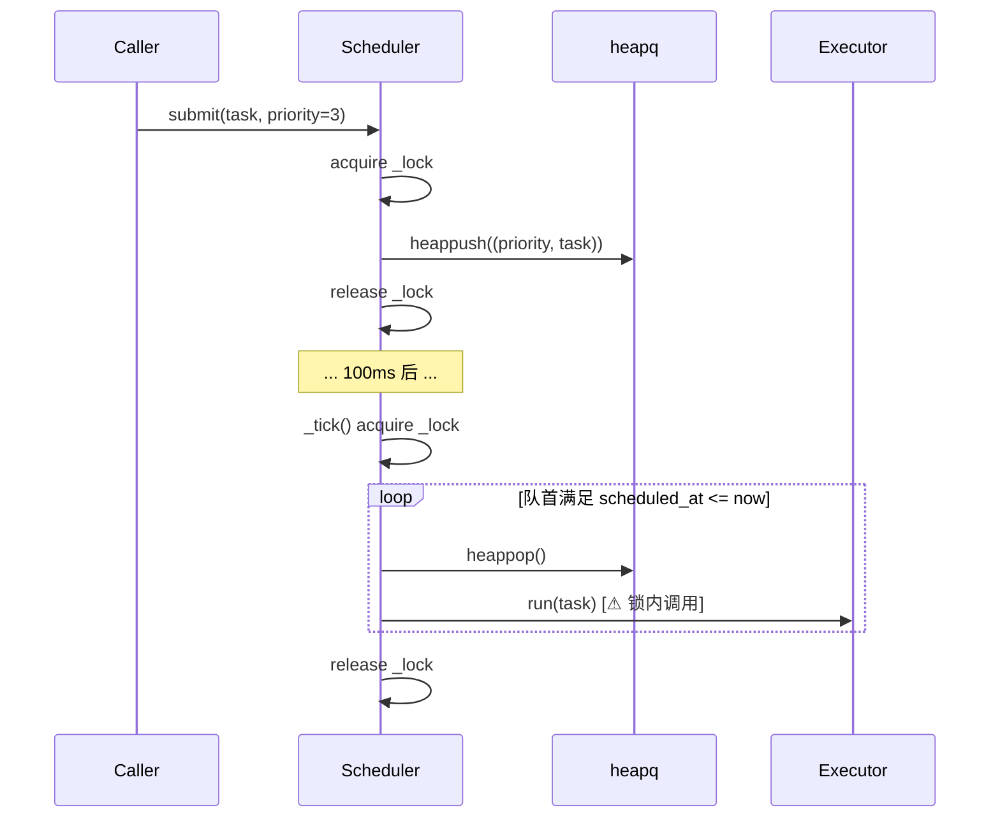
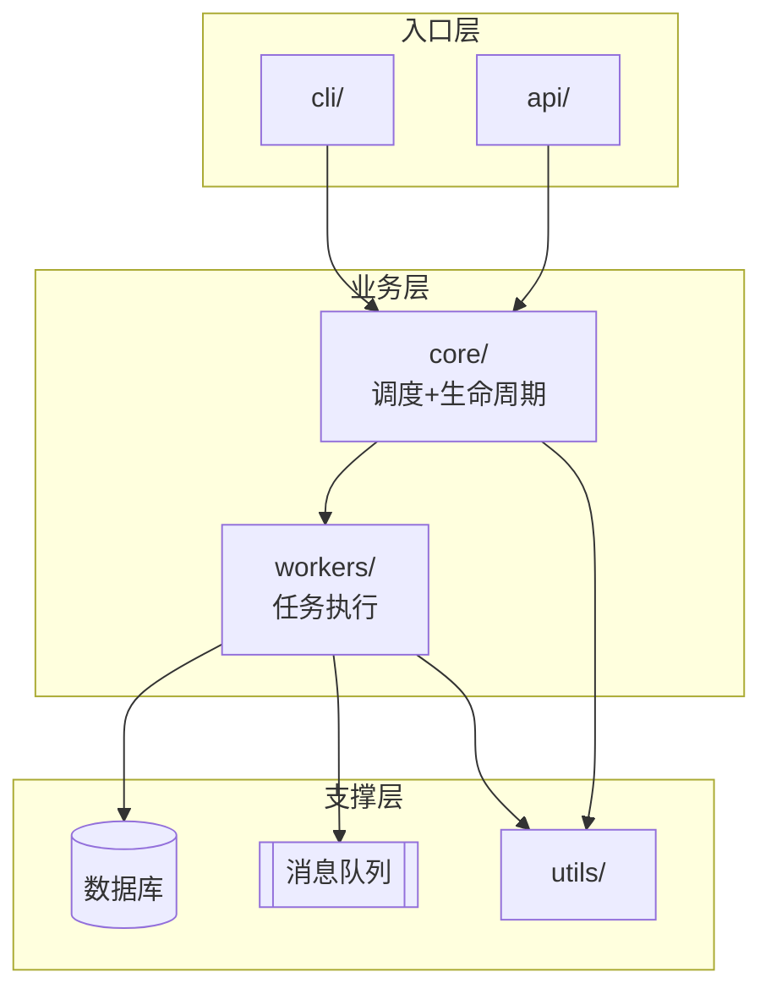

# 页面模板（page-templates）

本文件给出 wiki 四类页面的**结构模板**。写任何页面时先来这里对照。模板不是死的，可以根据内容删改字段，但**不要瞎加字段**——一致的结构让 wiki 可 grep、可索引、可维护。

## 通用约定

- **一律中文**。代码标识符保留原样。
- **每个页面顶部用 YAML frontmatter**，这样将来如果用户装 Obsidian Dataview 可以直接查。
- **所有对其他 wiki 页面的引用用相对路径** `[显示文字](../modules/xxx.md)`，不用 Obsidian 的 `[[wikilink]]`（相对路径兼容性更好）。
- **引用源码文件时用行号范围**：`` `src/core/scheduler.py:42-88` ``，用户看到这种记号应该能一眼跳过去看。
- **日期格式**统一 `YYYY-MM-DD`。

---

## 1. files/ 页面模板

路径：`wiki/files/<src__path__file>.md`

### 正常版（用于核心/重要文件）

```markdown
---
type: file
source: src/core/scheduler.py
lines: 312
last_updated: 2026-04-10
modules: [core]
concepts: [任务]
algorithms: [任务调度]
---

# `src/core/scheduler.py`

> 一句话定位：这个文件在整个项目里扮演什么角色。

## 做什么

2-5 句话说清楚：它的职责、输入、输出、被谁用、依赖谁。不要复述代码。

## 关键成员

只列**值得用户注意**的类/函数。样板成员不要列。

- **`class Scheduler`** (行 15-180)
  - 职责：...
  - 关键方法：
    - `submit(task)` (行 42-60) —— 做 X，注意 Y
    - `_tick()` (行 95-150) —— 核心循环，每 100ms 触发一次；这里有一个全局锁，疑似瓶颈（见 refactor.md）
  - 内部状态：`_queue`（优先级队列）、`_running`（当前任务集合）

- **`func enqueue(task, priority)`** (行 220-245)
  - 包装 Scheduler.submit 的门面函数，供外部模块调用

## 数据流

如果文件承载一段数据流，写清楚。可以用文字或小 mermaid 图：


## 依赖关系

- **依赖**：`utils/priority_queue.py`、`core/clock.py`、标准库 `threading`
- **被依赖**：`api/handlers.py`、`workers/background.py`（见 modules/api.md、modules/workers.md）

## 值得注意的地方

- 设计意图：...
- 可疑或不确定：...（重大问题记到 refactor.md，这里只写"需要进一步理解"级别的）

## 关联

- 相关概念：[任务](../concepts/任务.md)
- 相关算法：[任务调度](../algorithm/任务调度.md)
- 所属模块：[core](../modules/core.md)
```

### 极简版（用于胶水/样板/数据类/工具函数集合）

**极简版就是极简，别给我写超过 10 行！**

```markdown
---
type: file
source: src/utils/string_helpers.py
lines: 87
last_updated: 2026-04-10
modules: [utils]
trivial: true
---

# `src/utils/string_helpers.py`

字符串处理工具集合：`snake_to_camel`、`camel_to_snake`、`slugify`、`truncate`、`escape_html`、`unescape_html`、`normalize_whitespace`。均为纯函数，无状态。被 api 和 templates 模块引用。没有需要特别注意的实现细节。
```

判断用哪版的简单规则：如果你发现自己在极简版里想加第二段，**先问自己这个文件是不是真的那么简单**。如果是，那就别加；如果不是，换成正常版。

---

## 2. modules/ 页面模板

路径：`wiki/modules/<module_name>.md`

模块通常对应一个目录（`src/core/` → `modules/core.md`），有时对应多个目录（`src/services/auth/` + `src/middleware/auth.py` → `modules/auth.md`）。以"对外承担什么职责"为准，不是机械的目录映射。

```markdown
---
type: module
name: core
paths:
  - src/core/
files:
  - src/core/app.py
  - src/core/scheduler.py
  - src/core/registry.py
last_updated: 2026-04-10
depends_on: [utils, config]
depended_by: [api, workers]
---

# 模块：core

## 一句话

本模块提供 <项目> 的核心运行时：应用生命周期、任务调度、插件注册。是所有其他模块的基础。

## 对外提供什么

列出本模块暴露给其他模块的主要能力。每条写一行。

- **应用启动/关闭** —— `core.app.create_app()`、`core.app.shutdown()`
- **任务调度** —— `core.scheduler.enqueue(task, priority)`
- **插件注册** —— `core.registry.register(plugin)`、`core.registry.get(name)`

## 内部结构

这是模块的"小架构图"。不要写成文件清单——写成组件图。

```
    +--------------+       +-------------+
    |   app.py     |-----> | registry.py |
    | (生命周期)    |       | (插件表)     |
    +------+-------+       +-------------+
           |
           v
    +--------------+
    | scheduler.py |
    | (任务调度)    |
    +--------------+
```

或者用 mermaid 也行。重点是让读者一眼看到**模块内部是怎么分工的**。

## 关键文件

只列 3-8 个最重要的。全部文件在 index.md 里已经有了，不要在这里重复。

- [`app.py`](../files/src__core__app.md) —— 应用入口、生命周期
- [`scheduler.py`](../files/src__core__scheduler.md) —— 任务调度器
- [`registry.py`](../files/src__core__registry.md) —— 插件注册表

## 数据流 / 控制流

描述在这个模块内部、以及跨模块边界时，数据是怎么流动的。用文字或 mermaid。

## 与其他模块的关系

- **依赖**：`utils`（字符串/时间工具）、`config`（配置加载）
- **被依赖**：`api`、`workers`、`cli`

## 这个模块的坏味道（如果有）

高层指针，细节放到 refactor.md。

- `scheduler.py` 的全局锁疑似并发瓶颈
- `registry.py` 存在循环依赖风险（和 `api.handlers` 互相 import）

## 待回答的问题

扫描时遗留的疑问，后续继续扫更多文件或问用户可以解决的。
```

---

## 3. concepts/ 页面模板（静态结构）

路径：`wiki/concepts/<概念名>.md`

**概念页的文件名用中文**。这是让用户浏览时能一眼看懂的关键。

concepts 页写**静态结构**——数据结构、领域实体、术语定义、设计模式。**不要**在这里详细写"一步步怎么处理"——那是 algorithm 页的事。如果一个东西既是概念又是算法，主体写到 algorithm/，这里只留短指针。

```markdown
---
type: concept
name: 订单
files:
  - src/models/order.py
  - src/db/schemas/order.sql
  - src/api/serializers/order.py
last_updated: 2026-04-10
---

# 概念：订单

## 这是什么

2-4 句话。定义这个概念在本项目里是什么。注意是**在本项目里**——不要写通用的科普，要写这个项目是怎么理解这个概念的。

例：在本项目中，"订单"是用户购买一次或多次商品的聚合根。一个订单包含若干订单项、一个收货地址、一个支付记录、一个状态流转历史。订单在创建后不可删除，只能通过状态流转变更。

## 为什么存在

这个概念为什么在系统里以当前形式存在？如果从代码和注释里能推出来就写；推不出来就写"尚不明确"，不要瞎编。

## 数据结构

**这是 concepts 页的核心**。把字段、类型、约束、关系写清楚。

```
Order {
  id:            str (UUID)
  user_id:       str (外键 → User.id)
  status:        enum (draft|submitted|paid|shipped|delivered|cancelled)
  items:         List[OrderItem]       # 1..n
  shipping_addr: Address                # 内嵌
  payment_id:    str? (外键 → Payment.id, 可空直到 paid 状态)
  total_amount:  Decimal (>=0)
  created_at:    datetime
  updated_at:    datetime
}

OrderItem {
  sku:        str
  quantity:   int (>0)
  unit_price: Decimal
  snapshot:   dict   # 下单时的商品快照
}
```

关键约束：
- `total_amount == sum(item.quantity * item.unit_price for item in items)`（在 `models/order.py:calculate_total` 里维护）
- `status` 只能按固定方向流转，具体规则见 [algorithm/订单状态机](../algorithm/订单状态机.md)

## 实现分布

这个概念涉及哪些文件、每个文件承担什么角色。

- `src/models/order.py` —— ORM 模型，字段定义和基本校验
- `src/db/schemas/order.sql` —— 数据库 schema
- `src/api/serializers/order.py` —— API 序列化/反序列化

## 和其他概念的关系

- 一个 [用户](./用户.md) 可以有多个订单
- 一个订单关联一个 [支付](./支付.md)
- 订单的状态流转逻辑见 [订单状态机](../algorithm/订单状态机.md)（注意：状态机主体在 algorithm/，此处只是指针）

## 相关坏味道 / 重构建议

指向 refactor.md 里的相关条目。

## 关联

- 文件：[models/order.py](../files/src__models__order.md)、[serializers/order.py](../files/src__api__serializers__order.md)
- 模块：[models](../modules/models.md)、[api](../modules/api.md)
- 相关算法：[订单状态机](../algorithm/订单状态机.md)、[订单总额计算](../algorithm/订单总额计算.md)
```

---

## 4. algorithm/ 页面模板（动态过程）

路径：`wiki/algorithm/<算法名>.md`

**文件名用中文**。algorithm 页是这个 skill **最核心的产出之一**。每一页都应该回答："输入是什么 → 经过哪些步骤 → 输出是什么 → 为什么这么设计 → 有什么坑"。

触发条件（见 `workflow-scan.md`）：
- 通用算法或其变体（排序、查找、图、解析器、编码/解码、哈希、压缩等）
- 业务核心算法（推荐打分、风控、匹配、调度、计费、搜索排序、状态机转移等）
- 数据处理流水线（ETL、特征工程、清洗、聚合、批/流处理的多步变换）
- 关键计算逻辑（非平凡复杂度、需要注意边界、性能敏感）

**不要硬写**：如果某个"业务核心"其实只是 CRUD + 字段映射，**不要**建 algorithm 页硬凑。宁缺毋滥。

```markdown
---
type: algorithm
name: 任务调度
category: 业务算法          # 可选：通用算法 | 业务算法 | 数据流水线 | 关键计算
files:
  - src/core/scheduler.py
  - src/core/clock.py
  - src/workers/executor.py
entry_points:
  - src/core/scheduler.py:Scheduler.submit
  - src/core/scheduler.py:Scheduler._tick
complexity: "submit O(log n), tick O(k) 其中 k 是本轮出队的任务数"
last_updated: 2026-04-10
---

# 算法：任务调度

## 一句话

基于优先级队列 + 固定周期 tick 的轻量调度器，把 `submit` 进来的任务按优先级异步交给执行器运行。

## 输入 → 输出

- **输入**：通过 `Scheduler.submit(task, priority)` 进来的任务。`task` 是无参 callable，`priority` 是 0-9 的整数（越小越先）。
- **输出**：调度器本身不返回结果；任务的执行结果由 `Executor` 写入 `Task.result` 字段，调用方自己去轮询或订阅。
- **副作用**：执行器跑任务时可能写 DB、调外部 API。详见 [算法：任务执行](./任务执行.md)。

## 核心步骤

**这是 algorithm 页的核心**。把步骤写清楚，编号、带源码位置。

1. **入队** (`scheduler.py:submit` 行 42-60)
   - 加 `self._lock`
   - 构造 `Task` 对象，push 到 `_queue`（内部是 heapq）
   - 释放锁

2. **tick 轮询** (`scheduler.py:_tick` 行 95-150)
   - 由 `Clock` 每 100ms 触发一次（见 `clock.py:tick_loop`）
   - 加 `self._lock`
   - 从 `_queue` 里 pop 所有 `scheduled_at <= now` 的任务
   - **（当前实现问题）持锁期间直接调用 `Executor.run`，导致 I/O 在锁内，见 refactor.md**
   - 释放锁

3. **执行** (`executor.py:run` 行 20-80)
   - 在独立线程中跑 `task.callback`
   - 捕获异常，按 `task.retries` 决定是否重入 `_queue`

## 时序图



## 关键不变量

列出算法依赖的"如果这个不成立就会出 bug"的条件。

- `_queue` 始终保持堆序（由 heapq 的 API 保证，只要不绕过它直接改 `_queue[0]`）
- 任意时刻只有一个线程持有 `_lock`
- `task.retries` 单调递减（每次重入减 1），避免无限重试
- `Clock.tick_loop` 只有一个实例在跑（由 `clock.py:_started` 标志保证）

## 复杂度

- **时间**：`submit` 是 O(log n)（堆插入）；`_tick` 是 O(k log n)，k 是本轮出队数
- **空间**：O(n)，n 是队列中未执行的任务数
- **常数很重要的地方**：tick 周期 100ms 是硬编码。在低 QPS 场景下 100ms 造成 50ms 平均额外延迟，高 QPS 下又成为并发瓶颈（见下面"已知问题"）

## 边界条件 & 坑

用户重构时必须知道的细节：

- **空队列 tick**：`_tick` 会拿锁 → 发现空 → 放锁，每 100ms 一次空转。低负载下会持续消耗 CPU。
- **相同优先级**：heapq 遇到相同优先级时比较第二个元素，此处是 `Task` 对象；没有实现 `__lt__`，会触发 `TypeError`。当前实现靠 "优先级 + 单调递增 seq" 的 tuple 回避这个问题（行 50），**不能删掉这个 seq**。
- **重入锁**：`_lock` 是普通 `Lock` 不是 `RLock`。如果回调里再次调 `submit`（常见需求），会死锁。目前代码里没这样用，但重构时要注意。
- **关闭路径**：目前没有优雅关闭，进程退出时可能丢失 `_queue` 中的任务。

## 已知问题

每条要指向 refactor.md 或简要描述。

- **[严重]** `_tick` 持锁期间调用 `Executor.run`，包含 DB 写入（见 `refactor.md#_tick全局锁`）。这是高并发下的主要瓶颈。
- **[中等]** 空队列空转（上面"边界条件"里也提了）。建议改成条件变量等待。
- **[轻微]** tick 周期硬编码，应可配置。

## 为什么这么设计

如果能从代码、注释、commit message 里推出来，写在这里。推不出来就写"尚不明确"。

## 可能的重构方向

**不要替用户做决定**，列出 2-3 个方向和各自的影响面。细节可以新开一个 `concepts/重构建议_xxx.md` 页（见 refactor-guide.md）。

1. **锁粒度优化**（小改）：把锁缩到只保护 `_queue` 读写，I/O 移出锁外。影响面：scheduler.py 单文件。
2. **换成事件驱动**（大改）：用条件变量或 asyncio 替代 100ms tick。影响面：scheduler.py、clock.py、所有调用方需要适配 async。
3. **换成外部队列**（最大）：用 Redis / RabbitMQ 替代内存队列。影响面：新增依赖，大半个项目改。

## 关联

- 文件：[scheduler.py](../files/src__core__scheduler.md)、[clock.py](../files/src__core__clock.md)、[executor.py](../files/src__workers__executor.md)
- 模块：[core](../modules/core.md)、[workers](../modules/workers.md)
- 相关概念：[任务](../concepts/任务.md)（静态结构）
- 相关算法：[任务执行](./任务执行.md)、[重试策略](./重试策略.md)
- 重构条目：[refactor.md#_tick全局锁](../refactor.md)
```

### algorithm 页的最小可接受版本

如果一个算法很简单（例如一个 100 行的字符串 slugify），不需要上面全套结构。最小可接受版本：

```markdown
---
type: algorithm
name: slugify
category: 通用算法
files:
  - src/utils/slugify.py
last_updated: 2026-04-10
---

# 算法：slugify

## 一句话
把任意 Unicode 字符串转成 URL 安全的 ASCII slug。

## 输入 → 输出
- 输入：任意 `str`
- 输出：`str`，只含 `[a-z0-9-]`，长度 <= 80

## 核心步骤
1. NFKD 规范化（行 12）
2. 去除非 ASCII 字符（行 15）
3. 替换所有非字母数字为 `-`（行 18）
4. 合并连续 `-`，去首尾 `-`（行 21-23）
5. 截断到 80 字符，如果截断在 `-` 中间就继续往前退一位（行 25-30）

## 坑
- 全中文输入会得到空字符串。调用方没做这个 case 的处理，见 refactor.md。

## 关联
- 文件：[utils/slugify.py](../files/src__utils__slugify.md)
```

**原则**：有多少内容写多少，不要为了结构完整而填水。但"输入→输出"和"核心步骤"两节**永远必须有**，这是 algorithm 页的最小信息量。

---

## 5. architecture.md 的结构

架构页是**整个 wiki 最核心的一页**。它应该回答："如果有人只读 wiki 的一页，就读它，能对项目有一个骨架性的理解。"

```markdown
---
type: architecture
last_updated: 2026-04-10
coverage: "已扫描 src/ 下 32/42 个文件，core 和 api 模块已基本覆盖"
---

# 架构总览

## 本页的成熟度

写明当前的扫描覆盖情况和对应的可信度。例如：
- 初始阶段（尚未扫描源码）：只是基于 README 的猜测
- 早期（< 30% 文件已扫）：骨架已出，细节待补
- 中期（30-70%）：主要模块清晰，数据流主干已明
- 成熟（> 70%）：可作为重构的可靠依据

## 一张图：系统骨架

用 mermaid 画一张整体图，显示主要模块和它们之间的关系。



## 主要组件

每个主要模块一两句话。详情链到 modules 页。

- **[core](./modules/core.md)** —— 应用生命周期、任务调度、插件注册
- **[api](./modules/api.md)** —— HTTP 路由 + 请求处理
- **[workers](./modules/workers.md)** —— 后台任务执行
- **[utils](./modules/utils.md)** —— 无状态工具函数集合

## 主要数据流

挑 2-4 条关键路径，描述数据从哪里来、经过哪些组件、到哪里去。

### 数据流 A：HTTP 请求 → 任务入队 → 后台执行

```
Client 
  → api/handlers.py:handle_submit        # 解析请求
  → core/scheduler.py:enqueue            # 入队
  → workers/executor.py:_tick            # 轮询出队
  → workers/executor.py:run              # 执行
  → 写入 DB / 返回结果
```

### 数据流 B：...

## 运行时拓扑

这个项目运行起来是几个进程？怎么部署？如果从 Dockerfile / docker-compose / k8s manifests 里能看出来就写；看不出来就略过。

## 外部依赖

- **数据库**：PostgreSQL（通过 `db/connection.py` 连接）
- **消息队列**：Redis（通过 `mq/redis_client.py`）
- **外部 API**：Stripe（通过 `integrations/stripe.py`）

## 关键约定

项目的"潜规则"——那些不在文档里写但贯穿代码的约定。例如：
- 所有 API 响应都遵循 `{data, error, meta}` 结构（来自 `api/response.py`）
- 所有数据库查询都通过 `db/session.py:get_session()` 的上下文管理器
- 所有后台任务都继承 `workers/base.py:BaseTask`

## 已知的架构问题

**不是代码坏味道**（那些去 refactor.md），而是**架构层面**的。

- `core` 和 `api` 存在双向依赖，理想上应该单向
- `workers` 直接访问数据库，没有经过 service 层
- 配置分散在 `config/`、环境变量、`core/registry` 三处，没有统一来源

## 尚未弄清楚的地方

诚实记录当前 wiki 还没搞懂的东西。
```

---

## 6. refactor.md 的结构

见 `refactor-guide.md`。本页只说模板；判断什么是坏味道的方法在那一篇。

```markdown
# 重构清单

> 每一条必须含：严重程度 / 位置 / 问题描述 / 建议 / 发现时间

## 严重（需要优先处理）

### [2026-04-10] `core/scheduler.py:95-150` —— `_tick` 中的全局锁

**问题**：`_tick` 方法持有 `self._global_lock` 贯穿整个 100ms 循环，导致所有 `submit` 调用都被阻塞。

**证据**：行 98 加锁，行 148 才释放；中间有 I/O 操作（行 120 的 `db.write`）。

**影响**：高并发下 `submit` 延迟会被 tick 长度放大。

**建议**：把锁的范围缩到只保护 `self._queue` 的读写；I/O 操作移出锁外。

**关联**：`algorithm/任务调度.md`、`files/src__core__scheduler.md`

---

## 中等

（同结构）

## 轻微 / 代码风格

（同结构，但可以写得更简短）

## 可能的死代码 / 未使用

- `utils/legacy_parser.py` —— 整个文件没有被任何地方 import（用 `grep -r "legacy_parser" src/` 验证过）

## 疑问（需要和用户确认）

- `api/handlers.py:handle_admin_reset` 看起来会无条件清空 users 表，是不是只应该在测试环境用？
```

---

## 7. index.md 的结构

```markdown
# 页面索引

> 按类别组织。每次新增/更新页面时同步。可以用 `grep` 快速定位。

## 架构 & 重构

- [架构总览](./architecture.md) —— 最后更新 2026-04-10
- [重构清单](./refactor.md) —— 15 条（严重 2 / 中等 7 / 轻微 6）

## 模块（modules/）

| 模块 | 说明 | 最后更新 |
|------|------|---------|
| [core](./modules/core.md) | 生命周期、调度、注册 | 2026-04-10 |
| [api](./modules/api.md) | HTTP 路由和处理器 | 2026-04-09 |
| [workers](./modules/workers.md) | 后台任务执行 | 2026-04-09 |
| [utils](./modules/utils.md) | 纯函数工具集 | 2026-04-08 |

## 算法 & 数据处理（algorithm/）

| 算法 | 类别 | 说明 | 最后更新 |
|------|------|------|---------|
| [任务调度](./algorithm/任务调度.md) | 业务算法 | 优先级队列 + tick 循环 | 2026-04-10 |
| [订单状态机](./algorithm/订单状态机.md) | 业务算法 | 订单状态流转规则 | 2026-04-09 |
| [订单总额计算](./algorithm/订单总额计算.md) | 关键计算 | 含税费和折扣的总额计算 | 2026-04-09 |
| [搜索排序](./algorithm/搜索排序.md) | 业务算法 | BM25 + 业务因子加权 | 2026-04-08 |

## 概念（concepts/）

| 概念 | 类型 | 说明 | 最后更新 |
|------|------|------|---------|
| [订单](./concepts/订单.md) | 领域实体 | 订单聚合根和字段 | 2026-04-09 |
| [任务](./concepts/任务.md) | 数据结构 | 调度器里的 Task 结构 | 2026-04-10 |
| [请求响应约定](./concepts/请求响应约定.md) | 设计模式 | `{data, error, meta}` | 2026-04-09 |

## 文件（files/）

按源码路径字典序。只列"正常版"的文件；极简版的文件太多，放到一个折叠区。

### 正常文件

- [`src/core/app.py`](./files/src__core__app.md)
- [`src/core/scheduler.py`](./files/src__core__scheduler.md)
- ...

### 极简文件（胶水/工具/数据类）

<details>
<summary>共 14 个，点击展开</summary>

- [`src/utils/string_helpers.py`](./files/src__utils__string_helpers.md)
- [`src/utils/date.py`](./files/src__utils__date.md)
- ...

</details>
```

---

## 8. log.json 的格式（严格）

这是**唯一一个对格式有硬要求的文件**，因为脚本和 grep 会消费它。

```markdown
# 处理日志

## [2026-04-10] init | myproject
- 初始化 wiki 骨架
- 扫描发现 42 个源码文件（其中 3 个 >= 800 行）
- 扫描范围：src/
- 重点：重构前的架构理解

## [2026-04-10] scan | src/core/app.py
- 新建 files/src__core__app.md
- 更新 modules/core.md（定位为生命周期入口）
- 架构图草稿已写入 architecture.md

## [2026-04-10] scan | src/core/scheduler.py
- 新建 files/src__core__scheduler.md
- 更新 modules/core.md（新增调度器段）
- 新建 algorithm/任务调度.md
- 新建 concepts/任务.md（Task 数据结构）
- refactor.md 追加 1 条（严重：_tick 全局锁）

## [2026-04-10] query | "全局锁的影响范围？"
- 读了 scheduler.py、executor.py、api/handlers.py
- 回答已回填到 refactor.md 的相关条目（补了影响分析）

## [2026-04-10] lint | round-1
- 发现 2 个孤儿页
- 发现 3 处未建的 concepts 页候选
- 详见 wiki 对话历史
```

每条日志的第一行必须匹配正则 `^## \[\d{4}-\d{2}-\d{2}\] \w+ \| .+$`。

合法的 `<操作>`：`init` / `scan` / `query` / `lint` / `batch` / `note`
